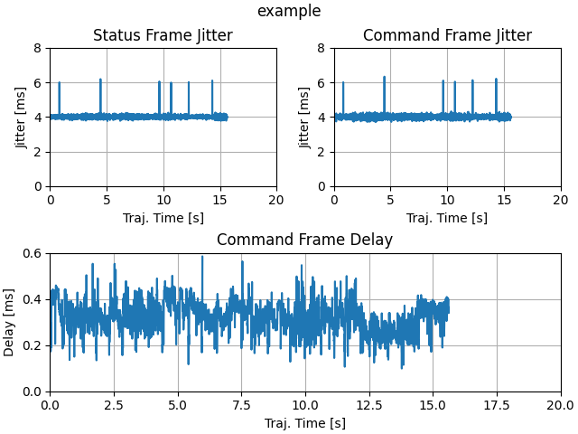

# jitter analyzer

## Description
This python project generates plots to analyze 'jitter' in a Wireshark dump. More rigorously stated, it computes the time differential of a signal as follows:

```
f(x, t) = x(t) - x(t-1)
```

## Use
Install dependencies:
```
python3 -m pip install -r requirements.txt
```
### Arguments
| Name           | Default     | Description                |
|----------------|-------------|----------------------------|
| `--data-dir`   | `./data`    | Location of data files     |
| `--figure-dir` | `/.figures` | Directory to store figures |
| `--hide`       |             | Don't show the figures     |
| `--save`       |             | Save the figures           |

### Run
Run the example:
```
python3 generate_plots.py --data-dir ./example --figure-dir ./example
```

### Output

If everything works, you will see the following image:


